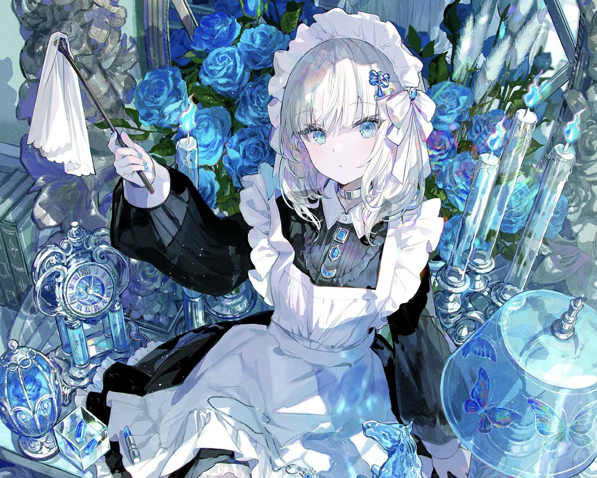

  

<h1 align="center">(>﹏<) hi, i'm <a href="https://tamilselvansportfolio.netlify.app">tamil selvan</a>!</h1>

  

<h3 align="center">welcome to my GitHub profile :◝(˶˃ ᵕ ˂˶)◜</h3>

I build scalable, data-driven systems and apps — data engineering, backend, and a bit of infra.

  <strong><a href="mailto:tamilselvansekar@proton.me">Email</a></strong> |
  <strong><a href="https://www.linkedin.com/in/tamilselvan-sekar-64321b26b/">LinkedIn</a></strong> |
  <strong><a href="https://www.reddit.com/user/SweetMention4369/">Reddit</a></strong>

<!-- Stats (LIGHT MODE: white + blue) -->

  

